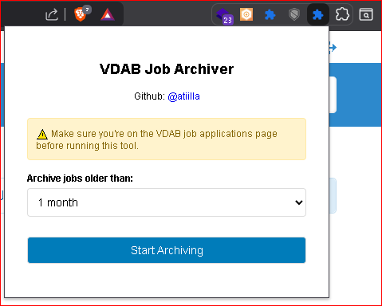

# VDAB Job Archiver Chrome Extension

A Chrome extension that automatically archives old job applications on the VDAB website.

## Features

- Archive job applications older than 1, 2, 3, or 6 months
- Progress tracking with visual feedback
- Safe operation with proper error handling
- Works directly within the VDAB website
- No need to expose sensitive cookies or tokens

## Installation

1. Download or clone this repository
2. Open Chrome and navigate to `chrome://extensions/`
3. Enable "Developer mode" in the top right corner
4. Click "Load unpacked" and select the folder containing these files
5. The extension icon will appear in your browser toolbar

## Usage

1. Navigate to your VDAB job applications page: `https://www.vdab.be/vindeenjob/prive/bewaarde-vacatures-en-sollicitaties`
2. Click the VDAB Job Archiver extension icon in your browser toolbar
3. Select how many months old jobs should be before archiving (1, 2, 3, or 6 months)
4. Click "Start Archiving"
5. The extension will process all pages and archive qualifying jobs
6. Monitor progress in the popup window
